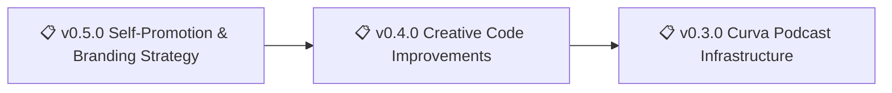

[nonlinear.nyc](https://nonlinear.nyc) is a personal site for Nicholas Frota, built with [Hugo](https://gohugo.io/) for knowledge management, creative coding experiments, and digital publishing. It serves as a content-first platform for notes, illustrations, podcasts, and interactive web features, with a modular structure for rapid prototyping and documentation.

> 🤖
>
> This project follows [backstage protocol](https://github.com/nonlinear/backstage) v0.3.4
>
> [README](README.md) 👏 [ROADMAP](backstage/ROADMAP.md) 👏 [CHANGELOG](backstage/CHANGELOG.md) 👏 checks: [local](backstage/checks/local/) 0, [global](backstage/checks/global/) 0
>
> Hugo notes and patterns: [HUGO.md](HUGO.md)
>
> 🤖

