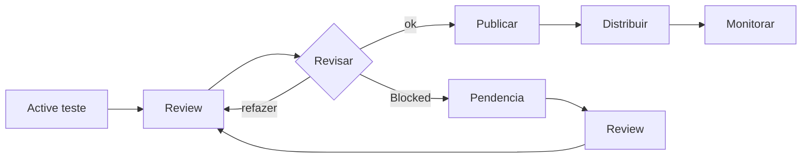

# Test Slide

Primeiro slide — título e intro

---

## Slide 2

---

## Slide 6 — fragmentos

- Item 1 <!-- .element: class="fragment" -->
- Item 2 <!-- .element: class="fragment highlight-red" -->
- Item 3 <!-- .element: class="fragment fade-out" -->

---

## Fim

Deck de teste — pronto para conectar o Reveal.js

Note: Notas do palestrante ficam aqui, invisíveis para a audiência.
