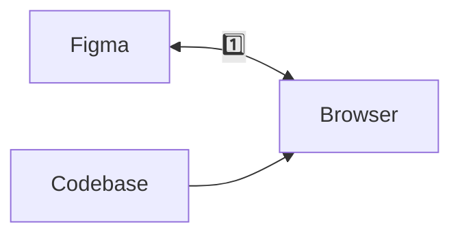
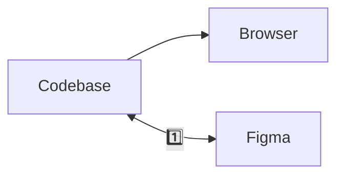

# Into Design Systems 2026

Building Design Systems with AI Agents  
Copenhagen, Denmark — May 15, 2026

---

- what Wiley has: design specs don't touch code, we communicate thru design specs, reviews and constant design discrepancy exercises
- industry standard: integrated design systems, connected with codebase and versioned (figma or code)
- AI promise: the ability to connect codebase and figma (both ways) with less overhead and more automated

---

## What we have

1. Design specs, demo, compounding design discrepancy

---

## The promise

1. Same variables, versioned

---

## Organize talks

- in quality?
- in relevance?
- in topics?

---

- [ ] list best practices we validated
- [ ] list innovations with links

---

## Day 1

1. [Prototyping for the unknown](/wiley/into-design-systems-2026/prototyping-for-the-unknown/)
1. [WhatsApp Web: Reclaiming UI Excellence through Vibe Coding](/wiley/into-design-systems-2026/whatsapp-vibe-coding/)
1. [Product Primitives: The New Material of Design System](/wiley/into-design-systems-2026/product-primitives-design-system/)
1. [The path to an AI enabled design system: Our approach and lessons learned](/wiley/into-design-systems-2026/ai-enabled-design-system-miro/)
1. [Agentic Design Systems](/wiley/into-design-systems-2026/agentic-design-systems/)
1. [I'm not an engineer but I ship code](/wiley/into-design-systems-2026/how-designers-ship-production-code/)
1. [Context > Probability: Design systems as AI infrastructure](/wiley/into-design-systems-2026/design-systems-ai-infrastructure/)
1. [Encoding governance on agentic design systems](/wiley/into-design-systems-2026/towards-an-agentic-design-system/) (12:30 AM, virada para Day 2)

---

## Day 2

1. [Building real design systems with agents](/wiley/into-design-systems-2026/build-design-systems-with-agents/)
1. [Vibe coding with zero drift: from Figma to Storybook to Production](/wiley/into-design-systems-2026/vibe-coding-from-figma-to-production/)
1. [Machine-Readable Design Systems for MCP and LLMs](/wiley/into-design-systems-2026/design-systems-for-mcp-and-llms/)
1. [From falling for markdown to solving real problems with scripts](/wiley/into-design-systems-2026/from-markdown-to-scripts/)
1. [Ship It! Vibe Coding Your First Figma Plugin](/wiley/into-design-systems-2026/vibe-coding-figma-plugin/)
1. [AI Without the Chaos: Context-Based Design Systems to the Rescue](/wiley/into-design-systems-2026/context-based-design-systems-ai/)
1. [Designers who ship plugin in 48 hours](/wiley/into-design-systems-2026/designers-who-ship-plugin-48-hours/) (sem horario explicito nas notas)

---